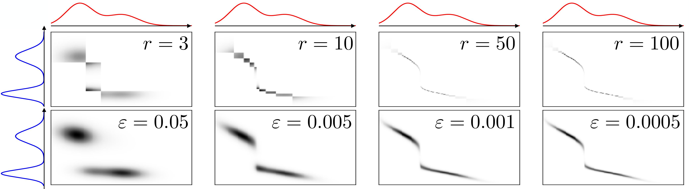
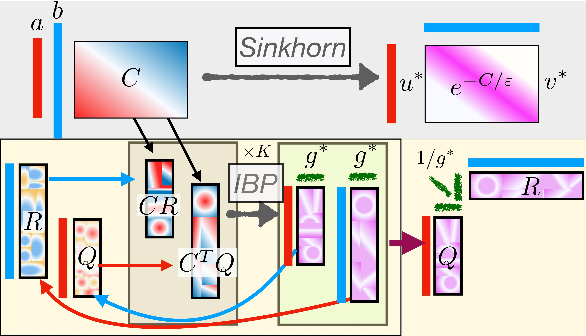
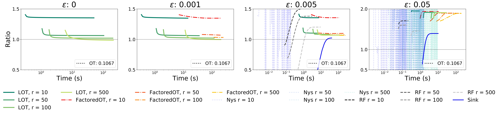

# Low-Rank Sinkhorn Factorization 
Code of the [paper](https://arxiv.org/pdf/2103.04737.pdf) by Meyer Scetbon, Marco Cuturi and Gabriel Peyré.

## A New Regularization Scheme for computing Efficiently the Optimal Transport Cost
In this work, we propose to regularize the optimal transport (OT) problem by adding a low-rank constraint on the couplings. In the following figure, we compare the couplings obtained by the Sinkhorn algorithm (bottom row) and by our proposed scheme (top tow).

We propose an efficient algorithm to solve the optimal transport problem under low-rank constraints and show on several examples that our method outperforms the Sinkhorn algorithm in term of time-accuracy tradeoff. In the following figure we illustrate the main differences between our proposed algorithm and the Sinkhorn one.

Our regularization can take advantage of the geometry of the problem, in particular when the cost matrix involved in the optimal transport problem admits a low-rank factorization. In this case, our method is able to compute the OT cost in linear time with respect to the number of samples. We present the time-accuracy tradeoff between different methods to compute the OT when the samples are drawn from two Gaussian distributions evaluated on 5000 points in 2D and the underlying cost is the squared Euclidean distance.

This repository contains a Python implementation of the algorithms presented in the [paper](https://arxiv.org/pdf/2103.04737.pdf).
